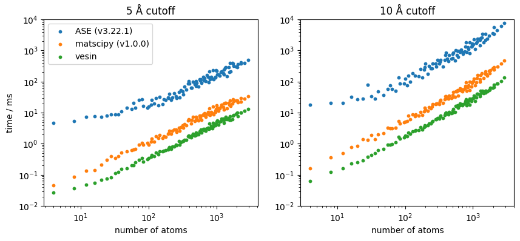

.. _benchmarks:

Benchmarks
==========

Here are the result of a benchmark of vesin, `ASE`_'s neighbor list
implementation (which is pure Python), and `matscipy`_ neighbor list (which uses
a C extension).

The benchmark runs on multiple super-cell of diamond carbon, up to 3000 atoms,
and considers two different cutoff: 5 Å and 10 Å.

These results are for an Apple M1 Max CPU; if you want to run it on your own
system, the corresponding script is in vesin's `GitHub repository
<bench-script_>`_.

.. _ASE: https://wiki.fysik.dtu.dk/ase/index.html
.. _matscipy: http://libatoms.github.io/matscipy/
.. _bench-script: https://github.com/Luthaf/vesin/blob/main/benchmarks/benchmark.py

    Speed comparison between vesin, `matscipy`_ and `ASE`_ neighbor list
    implementations. All the implementations scale linearly with the number of
    atoms, but the prefactor differs.
